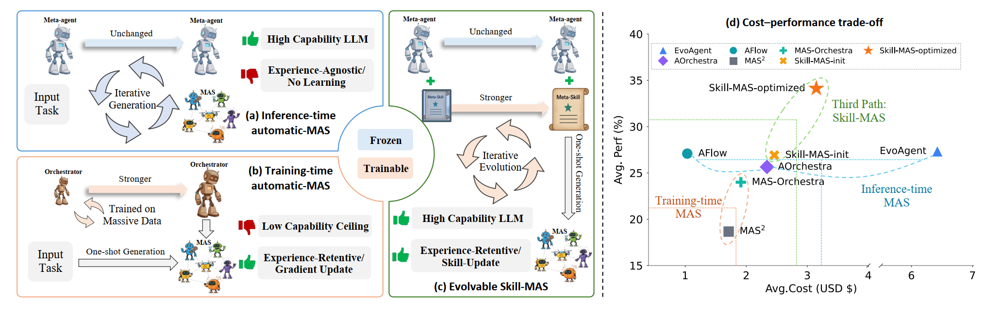

# 🚀 Skill-MAS: Evolving Meta-Skill for Automatic Multi-Agent Systems


<div align="center">

### One `SKILL.md` → Three-Stage MAS Build → Multi-Benchmark Evolution

[](https://arxiv.org/abs/2606.18837)
[](https://huggingface.co/papers/2606.18837)
[](https://github.com/linhh29/Skill_MAS)
[](https://linhh29.github.io/blog/Skill-MAS/index.html)

[](https://ports-baseball-paso-grow.trycloudflare.com/gallery)
[](https://ports-baseball-paso-grow.trycloudflare.com/demo)
[](https://ports-baseball-paso-grow.trycloudflare.com/local)

</div>

---

## 🥳 News

- **[2026-06-17]** We release the **code** and **paper**: [Skill-MAS: Evolving Meta-Skill for Automatic Multi-Agent Systems](https://arxiv.org/abs/2606.18837).


---

## Table of Contents

- [1. Overview](#1-overview)
- [2. Setup](#2-setup)
- [3. Demo Inference (Custom Question)](#3-demo-inference-custom-question)
- [4. Running Evolution](#4-running-evolution)
- [5. Evaluating a Fixed Skill](#5-evaluating-a-fixed-skill)
- [6. Tips](#6-tips)
- [Citation](#citation)

---

## 1. Overview

<p align="center">
  
</p>

Skill-MAS evolves a **single meta-agent skill file** (`SKILL.md`) that instructs an LLM to design and orchestrate a Multi-Agent System (MAS) in three stages:

| Stage | Name | Output |
|-------|------|--------|
| **1** | Task Decomposition | Sub-task graph & constraints |
| **2** | Agent Engineering | Sub-agent roles, tools, prompts |
| **3** | Workflow Orchestration | Executable MAS Python code |

Trajectories from each evolution round drive **contrastive reflection** and **skill rewriting**; the best skill snapshot is selected across rounds.

<p align="center">
  
</p>

**Two ways to use this repo**

| Path | When to use |
|------|-------------|
| 🚀 **[Demo Inference](#3-demo-inference-custom-question)** | One question + existing skill → build & run MAS immediately |
| 🔄 **[Evolution](#4-running-evolution)** | Multi-round skill optimization on benchmark validation sets |

---

### Repository Layout

```text
Skill_MAS/
├── assert/               # README figures (background.png, Method.png)
├── core/                 # CLI entry, evolution pipeline, resume, task selection
├── evolution/            # Rollout, contrastive reflection, skill optimizer, bench adapters
├── skill_mas/            # 3-stage MAS builder, async LLM client, model_config.json
├── template/             # Generated MAS code templates and SubAgent runtime
├── utils/                # Paths, cost tracking, logging, redaction
├── init_skill/           # Initial (pre-evolution) SKILL.md
├── optimized_skill/      # Pre-evolved skills per benchmark (ready to test)
├── dataset/              # Bundled benchmark code + data
│   ├── vitabench/        # VitaBench (src/vita, data/)
│   ├── deep_research_bench/
│   ├── hlemath/
│   └── BrowseComp-Plus/
├── run_*.sh              # Evolution wrappers (run from parent of Skill_MAS/)
├── demo_inference.py     # Single-question build + inference demo
├── demo_inference.sh     # Shell wrapper for demo_inference.py
└── results/              # Generated at runtime (not shipped)
```

### How an evolution round works

1. **Multi-trajectory rollout** (`evolution/rollout_multi.py`) — run `k` trajectories per validation task; the agent reads the current round's `SKILL.md`, generates MAS code via three build stages (`skill_mas/build.py`), executes it, and records scores plus phase-level traces.

2. **Contrastive reflection** (`evolution/contrastive_reflect.py`) — compare high- vs low-scoring trajectories and synthesize structured improvement signals.

3. **Skill bank optimization** (`evolution/bank_optimizer.py`) — an optimizer LLM rewrites the single `SKILL.md` using reflection reports and round statistics.

4. **Round selection** (`evolution/assemble_select.py`) — track per-round scores; after all rounds, select the best skill snapshot.

### Benchmark backends

| Backend | CLI flag | Validation data (default) | Evolution script | Per-bench eval script |
|---------|----------|---------------------------|------------------|------------------------|
| VitaBench | `--bench-backend vitabench` | `dataset/vitabench/data/vita_validate.json` | `run_vita.sh` | `dataset/vitabench/run_skill_mas.sh` |
| Deep Research Bench | `--bench-backend drb` | `dataset/deep_research_bench/data/drb_validate.jsonl` | `run_drb.sh` | `dataset/deep_research_bench/run_skill_mas.sh` |
| HLEMath | `--bench-backend hlemath` | `dataset/hlemath/data/hlemath_validate.jsonl` | `run_hlemath.sh` | `dataset/hlemath/run_skill_mas.sh` |
| BrowseComp-Plus | `--bench-backend bcp` | `dataset/BrowseComp-Plus/data/browsecomp_plus_validate.jsonl` | `run_bcp.sh` | `dataset/BrowseComp-Plus/run_skill_mas.sh` |

### Where results land

```text
Skill_MAS/results/{backend}_{model_tag}/
├── artifacts/
│   ├── skills/{bench_id}/{run_id}/round_XX/SKILL.md   # skill snapshots per round
│   └── runs/{bench_id}/{run_id}/summary_rXX.json      # round metrics
└── log/{bench_id}/{run_id}/round_XX/                  # traces, exports
```

Each round also saves:

```text
round_r/
  ├── trajectories/     # per-task, per-trajectory records
  ├── aspects/          # phase-level snapshots
  └── contrastive/      # reflection reports

skills/.../round_r/
  ├── SKILL.md          # skill used in this round (rewritten after r-1)
  ├── bank_meta.json    # optimization history
  └── knee_images/      # task-priority elbow plots
```

---

## 2. Setup

### Repository layout

Check out this repo so that `Skill_MAS/` lives under a **parent directory** (e.g. `demo/` or `arxiv_code/`). All benchmarks are vendored under `Skill_MAS/dataset/`; you do **not** need sibling copies of `vitabench_single/`, `hlemath/`, etc.

### Python environment

Install dependencies for Skill-MAS and the benchmark you use (see `dataset/vitabench/requirements.txt` and each benchmark's README).

```bash
conda create -n skill_mas python=3.11 -y
conda activate skill_mas
pip install openai pydantic loguru  # plus benchmark-specific deps
```

### Model & API configuration

Edit `skill_mas/model_config.json` — model ids, pricing, `base_url`, and `${OPENAI_API_KEY}` placeholders. Shell scripts resolve credentials via environment variables:


---

## 3. Demo Inference (Custom Question)

Use this when you want to try Skill-MAS on **your own task** without running multi-round evolution.

We ship ready-to-use skill files — no evolution required:

| Path | Role |
|------|------|
| `init_skill/SKILL.md` | Initial meta-agent skill (pre-evolution baseline) |
| `optimized_skill/vitabench.md` | Evolved skill for VitaBench |
| `optimized_skill/drb.md` | Evolved skill for Deep Research Bench |
| `optimized_skill/hlemath.md` | Evolved skill for HLEMath |
| `optimized_skill/bcp.md` | Evolved skill for BrowseComp-Plus |

`demo_inference.py` loads any of these paths, runs the three-stage build, **prints Stage-3 MAS code**, executes the generated workflow, and prints the answer.

Supported standalone datasets in the demo: **hlemath**, **drb**, **bcp**. VitaBench needs the full simulator (`run_vita.sh` or `dataset/vitabench/run_skill_mas.sh`).

### Option A — shell script (recommended)

```bash
cd /path/to/parent-of-Skill_MAS

# Usage: bash Skill_MAS/demo_inference.sh <model_id> <skill_path> "<question>"

bash Skill_MAS/demo_inference.sh qwen3.5-plus \
  Skill_MAS/init_skill/SKILL.md \
  "What is 17 + 28? Give the final answer in \\boxed{...} form."

bash Skill_MAS/demo_inference.sh qwen3.5-plus \
  Skill_MAS/optimized_skill/hlemath.md \
  "Find the number of positive integers n such that n^2 + 3n + 2 is divisible by n + 1."
```

### Option B — Python directly

```bash
cd /path/to/parent-of-Skill_MAS
export OPENAI_API_KEY="your-key"
export PYTHONPATH="$(pwd):$(pwd)/Skill_MAS/dataset:$(pwd)/Skill_MAS/dataset/vitabench/src"

python Skill_MAS/demo_inference.py \
  --model qwen3.5-plus \
  --skill Skill_MAS/optimized_skill/drb.md \
  --question "Summarize recent progress in retrieval-augmented generation." \
  --verbose

python Skill_MAS/demo_inference.py \
  --model qwen3.5-plus \
  --skill Skill_MAS/init_skill/SKILL.md \
  --question "Your task prompt here." \
  --dataset hlemath \
  --save-mas-code /tmp/demo_mas.py
```

### CLI flags

| Flag | Description |
|------|-------------|
| `--skill` | Path to `SKILL.md` or `optimized_skill/*.md` (required) |
| `--question` | Input task / question (required) |
| `--model` | Agent model id from `model_config.json` (default: `qwen3.5-plus`) |
| `--dataset` | `hlemath` \| `drb` \| `bcp` \| `vita`; auto-inferred from skill filename when omitted |
| `--save-mas-code` | Optional path to save generated MAS Python code |
| `--verbose` | Print parsed JSON from each build stage |

BrowseComp-Plus skills (`bcp`) additionally accept `--bcp-index-path`, `--bcp-retrieval-topk`, `--bcp-doc-max-tokens`, and `--bcp-max-retrieval-rounds`. The BM25 index under `dataset/BrowseComp-Plus/scripts_build_index/indexes/bm25` must be available (see that benchmark's README).

> For BrowseComp-Plus, refer to the official repo for data preprocessing. We do not ship a plain-text data file used in our paper, to reduce data contamination risk.

---

## 4. Running Evolution

### Quick start (shell scripts)

Run from the directory **above** `Skill_MAS/`. Each `run_*.sh` takes two positional arguments: **agent model id** and **max concurrency**.

```bash
cd /path/to/parent-of-Skill_MAS

# VitaBench (cross-domain: delivery, instore, ota)
bash Skill_MAS/run_vita.sh <model_id> <max_concurrency>

# Deep Research Bench
bash Skill_MAS/run_drb.sh <model_id> <max_concurrency>

# HLEMath
bash Skill_MAS/run_hlemath.sh <model_id> <max_concurrency>

# BrowseComp-Plus
bash Skill_MAS/run_bcp.sh <model_id> <max_concurrency>
```

Default evolution settings in the scripts:

| Parameter | Default | Meaning |
|-----------|---------|---------|
| `ROUNDS` | `10` | Number of evolve rounds |
| `K_TRAJ` | `5` | Trajectories sampled per task per round |
| `MAX_PROBLEMS` | `0` | Validation subset size (`0` = all tasks) |
| `RUN_ID` | `exp1` | Logical run name under `results/` |

Tweak the variables at the top of each script to change rounds, task limits, evaluator/judge models, etc.

### CLI (direct invocation)

```bash
cd /path/to/parent-of-Skill_MAS
export OPENAI_API_KEY="your-key"
export PYTHONPATH="$(pwd):$(pwd)/Skill_MAS/dataset:$(pwd)/Skill_MAS/dataset/vitabench/src"

python -m Skill_MAS evolve \
  --bench-backend vitabench \
  --bench-id skill_mas_agent \
  --run-id exp1 \
  --domain "delivery,instore,ota" \
  --jsonl Skill_MAS/dataset/vitabench/data/vita_validate.json \
  --rounds 10 \
  --k-trajectories 5 \
  --agent-llm <model_id> \
  --user-llm <model_id> \
  --evaluator-llm <evaluator_model_id> \
  --optimizer-llm <model_id> \
  --max-concurrency 16 \
  --max-steps 300 \
  --language chinese
```


### Resume and fresh runs

| Mode | How |
|------|-----|
| **Resume** | Re-run the same command with the same `--run-id`. Completed rounds are detected via `summary_rXX.json`. |
| **Fresh run** | Add `--fresh` to allocate a new run directory (`exp1_2`, `exp1_3`, …) and restart from `round_00`. |

---

## 5. Evaluating a Fixed Skill

Run a benchmark with an existing skill — **no multi-round evolution**. The first argument is a path **relative to `Skill_MAS/`** (e.g. `init_skill/SKILL.md` or `optimized_skill/hlemath.md`).

```bash
cd /path/to/parent-of-Skill_MAS
export OPENAI_API_KEY="your-key"

bash Skill_MAS/dataset/hlemath/run_skill_mas.sh init_skill/SKILL.md <model_id> <max_concurrency>
bash Skill_MAS/dataset/deep_research_bench/run_skill_mas.sh optimized_skill/drb.md <model_id> <max_concurrency>
bash Skill_MAS/dataset/BrowseComp-Plus/run_skill_mas.sh optimized_skill/bcp.md <model_id> <max_concurrency>
bash Skill_MAS/dataset/vitabench/run_skill_mas.sh optimized_skill/vitabench.md <model_id> <max_concurrency>
```

---

## 6. Tips

- Start with **`demo_inference.sh`** on one HLEMath question before launching a full evolution run — it is the fastest way to validate API config and skill quality.
- Use **`--verbose`** in `demo_inference.py` to inspect Stage 1–2 JSON; Stage 3 MAS code is always printed before execution.
- Begin with smaller `MAX_PROBLEMS`, fewer `ROUNDS`, or lower `K_TRAJ` in the shell scripts.
- **`--fresh`** vs resume: same `--run-id` resumes; add `--fresh` when you want a clean experiment directory.
- BrowseComp-Plus requires the BM25 index and official data pipeline — see `dataset/BrowseComp-Plus/README.md`.
- Cached trajectories and skills live under `results/`; add that path to `.gitignore` if you fork the repo.

<div align="center">

### 🌟 If you find Skill-MAS helpful, please consider citing our paper and giving us a star!

</div>

---

## BibTeX


```bibtex
@article{lin2026skill,
  title   = {Skill-MAS: Evolving Meta-Skill for Automatic Multi-Agent Systems},
  author  = {Lin, Hehai and Yang, Qi and Qin, Chengwei},
  journal = {arXiv preprint arXiv:2606.18837},
  year    = {2026}
}
```
